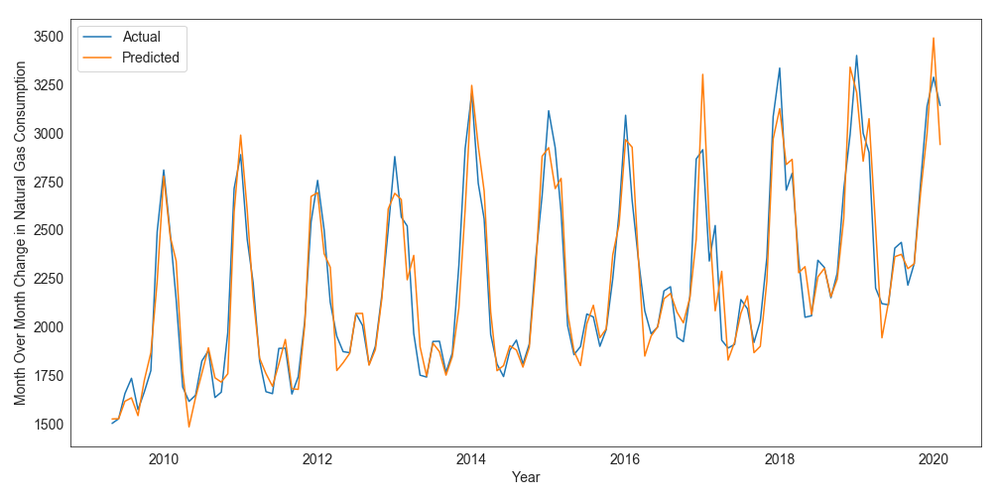

## __The Concept of Seasonality__
*Seasonality* is a repeated pattern within a *year* that occurs at specific, regular intervals. Each year, sales of video games may exhibit a sharp spike in volume during the period of Christmas. That means that on top of your ARIMA model, you may have a seasonal component which can be modeled using $ARIMA(p, d, q)(P, D, Q)_m$. If it takes place over longer periods than a year, it is called *cycle*. Read more about time series patterns in the [patterns section](Patterns_ts.html)

* P = number of seasonal autoregressive components
* D = number of seasonal differences
* Q = number of seasonal moving average components
* m = the seasonal factor. The number of steps for a single seasonal period. e.g., 12 = monthly.

<center></center>

The basic idea is that many sales series show typical seasonal patterns over the year. Like higher sales periods, lower sales period. During christmas, it may be higher, during summer, it may be lower. The order of seasonality is basically the sames as we would do with non-seasonal processes. *However, the patterns occur at lags 1s, 2s, 3s instead of 1, 2, 3.* That means, The predictions of Christmas sales this year are a function of Christmas last year, contra to what was predicted a few months ago.

An example: $ARIMA(1, 1, 1)(1, 1, 1)_4$ says that I want to integrate my model (d) by one period. And also, I want to integrate based on 4 periods in the past. This would go for MA and AR as well.

## __How To Identify and Remove Seasonality?__
It's subjective. The best way is to plot your data and have a look. It can be dealt with by:

* Dummy variables
* De-seasoning / Decomposition
* Sinus and Cosinus functions (more advanced)


```{r }
library(forecast)
arima <- arima.sim(model = list(order = c(0, 1, 0)), n = 100)
plot(arima)
model <- Arima(ts(rnorm(100),freq=4), order=c(1,1,1), seasonal=c(1,1,1),
                 fixed=c(phi=0.5, theta=-0.4, Phi=0.3, Theta=-0.2))
foo <- simulate(model, nsim=1000)
  fit <- Arima(foo, order=c(1,1,1), seasonal=c(1,1,1))
plot(foo)
```